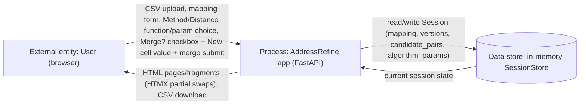
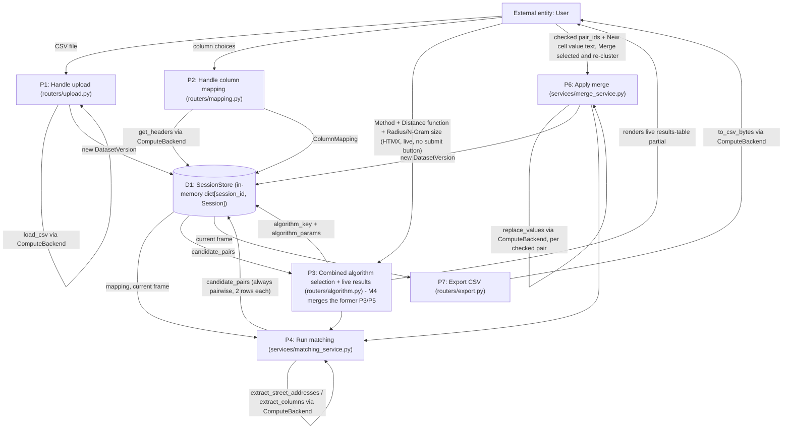

# Data Flow Diagram — AddressRefine

Status: Living document. Last revised: M4 BA pass (2026-06-30). `P3`/`P5`
below were merged into one combined process by M4 (was two separate
processes — algorithm selection then results review/mutation — in the
M2/M3 version of this diagram).

## Level 0 — Context

## Level 1 — Major processes

## Notes

- All processes that touch the dataframe go through `ComputeBackend`
  (`app/compute/backend.py`) rather than manipulating pandas directly —
  this is the seam that would let a future Spark backend be substituted.
- `P4` (matching) only ever receives `dict[int, str]` from the compute
  backend, never the frame itself — this boundary is what keeps
  `app/algorithms/` backend-agnostic.
- There is exactly one data store (`D1`, the in-memory `SessionStore`); no
  external database or third-party API is part of this system's data
  flow in v1.
- **M4 change**: the former `P5` ("Render/mutate results", with its own
  per-pair accept/reject/representative mutation path) no longer exists as
  a separate process. Live recompute (Method/Distance function/param
  change) and merge submission are now the only two write paths into `P4`,
  both routed through the single combined `P3` process — there is no
  intermediate per-pair "accepted" state stored in `D1` between them.
