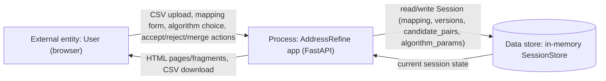
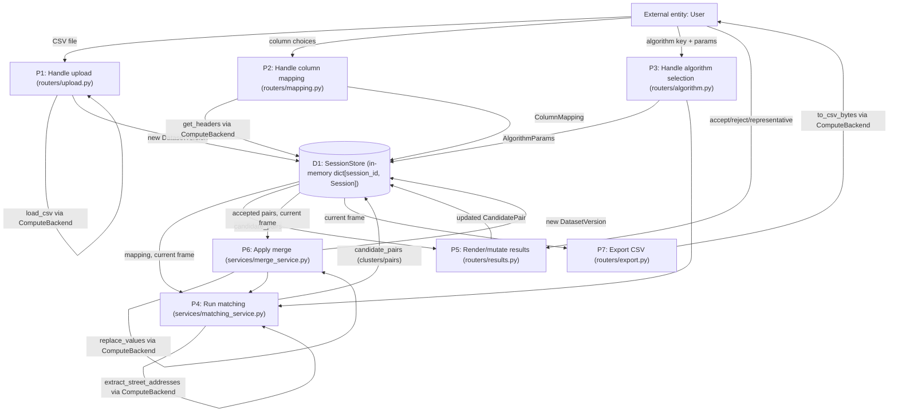

# Data Flow Diagram — AddressRefine

Status: Living document. Last revised: M2 BA pass (2026-06-28).

## Level 0 — Context

## Level 1 — Major processes

## Notes

- All processes that touch the dataframe go through `ComputeBackend`
  (`app/compute/backend.py`) rather than manipulating pandas directly —
  this is the seam that would let a future Spark backend be substituted.
- `P4` (matching) only ever receives `dict[int, str]` from the compute
  backend, never the frame itself — this boundary is what keeps
  `app/algorithms/` backend-agnostic.
- There is exactly one data store (`D1`, the in-memory `SessionStore`); no
  external database or third-party API is part of this system's data
  flow in v1.
