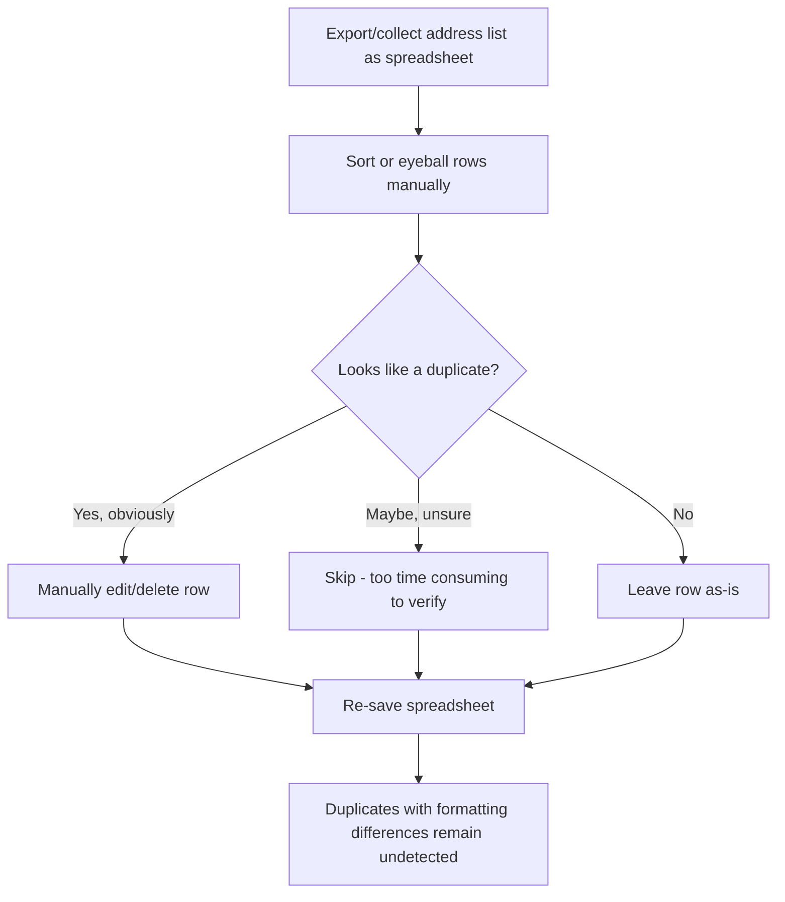
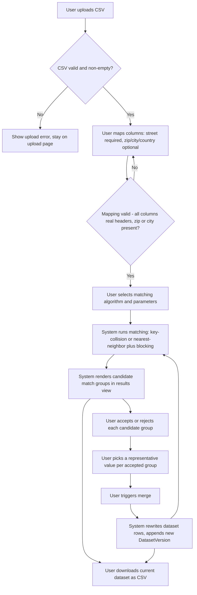
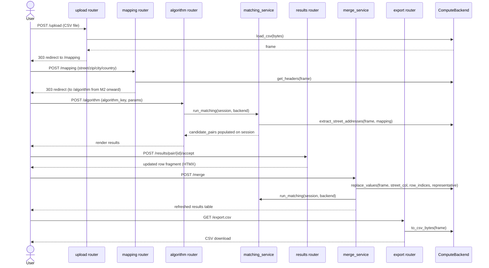

# Business Process Models — AddressRefine

Status: Living document. Last revised: M2 BA pass (2026-06-28).

## As-Is: Manual address deduplication (before AddressRefine)

Key pain points this process has: no systematic similarity comparison, no
record of why a row was judged duplicate/not, doesn't scale past a few
hundred rows, easy to introduce data-loss by editing the wrong row.

## To-Be: AddressRefine workflow

Note: the loop from `K` back to `F` is deliberate — `merge_service.apply_merge`
reruns matching immediately after a merge so the results view always reflects
current data, using whatever algorithm/params are currently selected.

## Sequence: end-to-end happy path (target state, all milestones)

