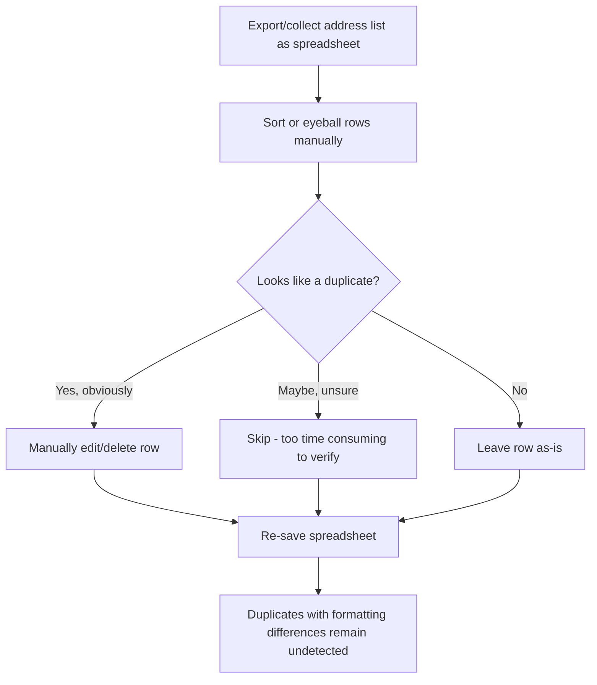
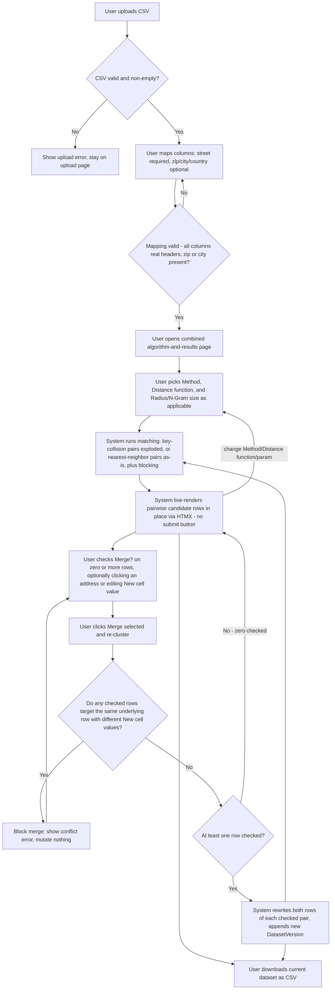

# Business Process Models — AddressRefine

Status: Living document. Last revised: M4 BA pass (2026-06-30). The To-Be
flow and sequence diagram below reflect M4's combined algorithm-and-results
page (replacing the earlier separate algorithm-selection page -> read-only
results page -> accept/reject/representative -> merge flow).

## As-Is: Manual address deduplication (before AddressRefine)



Key pain points this process has: no systematic similarity comparison, no
record of why a row was judged duplicate/not, doesn't scale past a few
hundred rows, easy to introduce data-loss by editing the wrong row.

## To-Be: AddressRefine workflow



Note: the loop from `M` back to `G` is deliberate — `merge_service.apply_merge`
reruns matching immediately after a successful merge so the live table always
reflects current data, using whatever algorithm/params are currently
selected. This replaces the M2/M3-era flow where algorithm selection and
results review were two separate pages connected by a `POST /algorithm`
redirect, and where merge was gated behind a per-pair accept/reject +
representative-selection step (dropped in M4 — see `brd.md` G3 and
`frd.md` FR-5/FR-6).

## Sequence: end-to-end happy path (target state, M4 onward)

```mermaid
sequenceDiagram
    actor User
    participant Upload as upload router
    participant Mapping as mapping router
    participant Algorithm as algorithm router (combined page)
    participant Matching as matching_service
    participant Merge as merge_service
    participant Export as export router
    participant Backend as ComputeBackend

    User->>Upload: POST /upload (CSV file)
    Upload->>Backend: load_csv(bytes)
    Backend-->>Upload: frame
    Upload-->>User: 303 redirect to /mapping

    User->>Mapping: POST /mapping (street/zip/city/country)
    Mapping->>Backend: get_headers(frame)
    Mapping-->>User: 303 redirect to /algorithm

    User->>Algorithm: GET /algorithm
    Algorithm->>Matching: run_matching(session, backend) [if algorithm already selected]
    Algorithm-->>User: render combined page (Method/Distance function/param controls + live results table)

    User->>Algorithm: HTMX request (Method, Distance function, or Radius/N-Gram size changed)
    Algorithm->>Matching: run_matching(session, backend)
    Matching->>Backend: extract_street_addresses / extract_columns(frame, mapping)
    Matching-->>Algorithm: candidate_pairs populated on session (each pair = exactly 2 rows)
    Algorithm-->>User: refreshed results-table partial (HTMX swap, no full reload)

    Note over User: client-side only (app/static/js/match.js):<br/>check "Merge?" -> defaults "New cell value";<br/>click an address -> sets "New cell value" + auto-checks "Merge?"

    User->>Algorithm: POST /merge (checked pair_ids + their New cell values)
    Algorithm->>Merge: apply_merge(session, backend, merge_requests)
    alt conflicting targets for the same underlying row
        Merge-->>Algorithm: conflict error (no mutation)
        Algorithm-->>User: validation error listing conflicts
    else no conflicts, >=1 row checked
        Merge->>Backend: replace_values(frame, street_col, row_indices, new_value) [per checked pair]
        Merge->>Matching: run_matching(session, backend)
        Merge-->>Algorithm: refreshed candidate_pairs
        Algorithm-->>User: refreshed results-table partial
    else zero rows checked
        Merge-->>Algorithm: no-op
        Algorithm-->>User: unchanged table
    end

    User->>Export: GET /export.csv
    Export->>Backend: to_csv_bytes(frame)
    Export-->>User: CSV download
```
