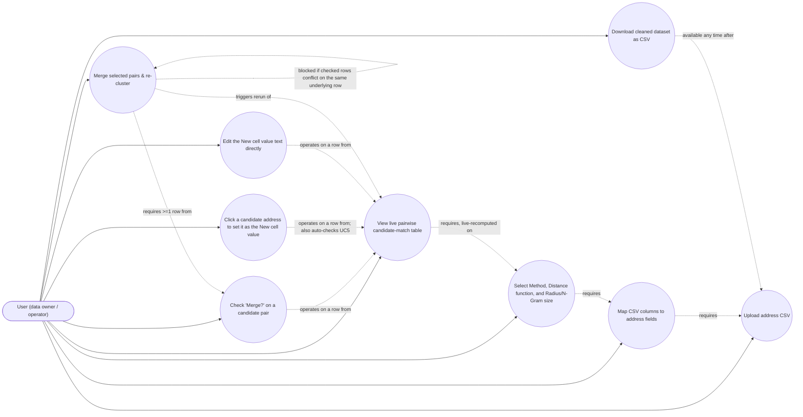

# Use Case Diagram — AddressRefine

Status: Living document. Last revised: M4 BA pass (2026-06-30). M4 replaces
the accept/reject/representative-selection use cases (UC5–UC7 in the
M2/M3 version of this diagram) with checkbox/click/edit/merge use cases
that operate on individual pairs directly, with no intermediate
accept/reject state — see `brd.md` G3 and `frd.md` FR-5/FR-6 for the
rationale.

> Caveat: Mermaid has no native UML use-case diagram shape (no actor/oval
> notation). The diagram below uses a `flowchart` with the actor as a node
> and use cases as rounded nodes, connected by plain edges, as an
> approximation. It should be read as "actor participates in use case", not
> as a strictly notated UML use-case diagram.

## Use case status by milestone

| Use case | Status |
|---|---|
| Upload address CSV | Shipped (M1) |
| Map CSV columns to address fields | Shipped (M1) |
| Select Method, Distance function, and Radius/N-Gram size | M2 (Fingerprint/N-Gram only, flat single-select); M3 adds Levenshtein/PPM; M4 restructures into Method -> Distance function cascade with live HTMX recompute, no submit button |
| View live pairwise candidate-match table | M2 (read-only, cluster-shaped rows); M3 adds distance column for NN; M4 makes it live (HTMX) and always-pairwise (no multi-member clusters) |
| Check "Merge?" on a candidate pair | Planned (M4) — replaces the dropped "Accept a candidate group" use case |
| Click a candidate address to set it as the New cell value | Planned (M4) — replaces the dropped "Choose representative value for a group" use case |
| Edit the New cell value text directly | Planned (M4) |
| Merge selected pairs & re-cluster | Planned (M4) — replaces the dropped "Merge accepted groups" use case; conflicting selections are blocked, not silently resolved |
| Download cleaned dataset as CSV | Planned (M5) |

**Dropped use cases (M2/M3-era plan, never implemented in code, removed by
the M4 redesign rather than deferred):** "Reject a candidate group" (no
reject concept exists — an unwanted pair is simply left unchecked) and
"Choose representative value for a group" via a mode toggle (superseded by
the always-editable "New cell value" field). See
`data-dictionary.md`'s "Dropped in M4" table for the corresponding field-
level detail.
