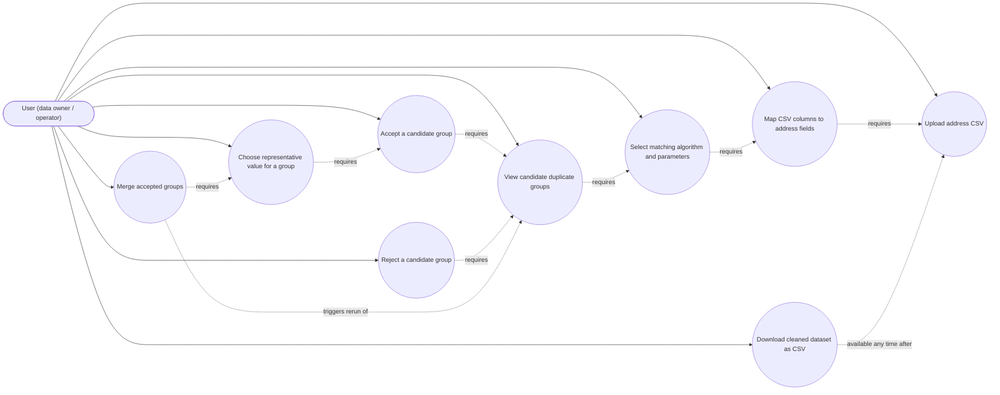

# Use Case Diagram — AddressRefine

Status: Living document. Last revised: M2 BA pass (2026-06-28).

> Caveat: Mermaid has no native UML use-case diagram shape (no actor/oval
> notation). The diagram below uses a `flowchart` with the actor as a node
> and use cases as rounded nodes, connected by plain edges, as an
> approximation. It should be read as "actor participates in use case", not
> as a strictly notated UML use-case diagram.

## Use case status by milestone

| Use case | Status |
|---|---|
| Upload address CSV | Shipped (M1) |
| Map CSV columns to address fields | Shipped (M1) |
| Select matching algorithm and parameters | M2 (Fingerprint/N-Gram only); M3 adds Levenshtein/PPM |
| View candidate duplicate groups | M2 (read-only); interactive accept/reject in M4 |
| Accept a candidate group | Planned (M4) |
| Reject a candidate group | Planned (M4) |
| Choose representative value for a group | Planned (M4) |
| Merge accepted groups | Planned (M4) |
| Download cleaned dataset as CSV | Planned (M5) |
